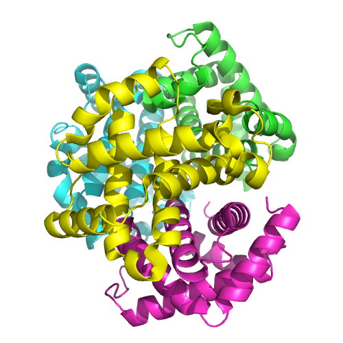
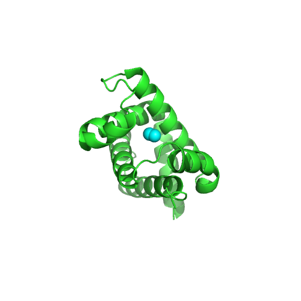
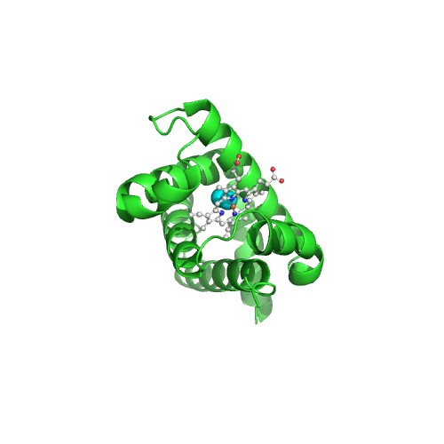

# Introduction

Pymolr provides an R interface to [PyMol](https://www.pymol.org/). Pymolr is
primarily intended to aid reproducible research by providing a programmatic
interface for generating publication-quality images, but every PyMol command
is made available through this package.

This vignette is intended to show you how to use the pymolr package, not as a
PyMol tutorial. A basic familiarity with PyMol commands is assumed.

# Using pymolr

PyMol commands are made available as methods of the `Pymol` class
(`help("Pymol-class")`). For clarity in this vignette I will refer to
PyMol (the tool) as "PyMol" and the `Pymol` class as "`Pymol`" in monospaced
font.

When a `Pymol` instance is created, pymolr will spawn a new PyMol process:

```r
# Spawns a new PyMol process
pymol <- Pymol()
```
The actual `pymol` executable run by the `Pymol` class is found by calling
`Sys.which("pymol")`. This can be overridden by setting the `executable`
argument when constructing a `Pymol` object:
`Pymol(executable="/path/to/pymol")`.

Methods called on `pymol` will operate on the PyMol process spawned when `pymol`
was constructed. Creating multiple `Pymol` objects will spawn multiple separate
PyMol processes. To stop PyMol from running, either use the `$quit()` method of
PyMol or `rm()` the `Pymol` object and wait for the garbage collector.

```r
# Sends "quit" command to PyMol
pymol$quit()

# Alternatively, the "quit" command is sent on garbage collection:
pymol <- Pymol()
rm(pymol)
gc()
```

By default, `Pymol` will spawn a PyMol process in the background without any
visible interface. To show the interface, set `show.gui=TRUE` in the `Pymol`
constructor: `Pymol(show.gui=TRUE)`.

### Caution: running multiple processes

Creating multiple `Pymol` objects will spawn multiple PyMol processes.
Successive calls to `Pymol()` will, however, fail unless the `rpc.port`
argument is set (and unique) for each call. This is because PyMol must start a
server that listens for our commands, and if the port is not free the server
cannot start. The `Pymol` constructor explicitly checks to see if a PyMol server
is accessible on the current port and, if so, refuses to connect.

## Running PyMol commands

All of PyMol's usual commands are available as methods of the `Pymol` class. For
example, here is how you could fetch a file from the PDB and switch to cartoon
mode. To more obviously illustrate what is happening, we set `show.gui=TRUE`.


```r
# Create a temporary directory into which PyMol can download structures.
fetch.dir <- tempdir()
pymol <- Pymol(show.gui=TRUE)
# Save downloaded structures in our temporary directory.
pymol$set("fetch_path", fetch.dir)
# Download and display a structure in PDB format.
pdb.12as <- pymol$fetch("12as", type="pdb")
# Render it as a pretty cartoon
pymol$as("cartoon")
```

## PyMol selections

Constructing PyMol selections in R would quickly become tedious. If we were to
represent selections as simple strings of characters, we would end up writing
lots of code like this:

```r
residue.range <- "(resi 1-10)"
atom.types <- "(name ca)"
combined <- paste("(", residue.range, "&", atom.types, ")")
pymol$color("red", combined)
```
Any errors in selections will only be discovered when the selections are used by
PyMol, which knows nothing about your R scripts and cannot provide much useful
debugging information. It would be helpful if selections were validated when
created rather than executed, with informative error information.

To help with this, pymolr provides the `Selection` class, which allows you to
specify selections directly in R. When a `Selection` is coerced into a character
string, it is converted into the format required by PyMol:

```r
as.character(Selection(resi=c(-1:2, 1:10, 20:40), name="CA"))
#> [1] "resi \\-1-2+1-10+20-40 & name CA"
```
Note that the `Selection` class took care of collapsing ranges of numbers like
`1:10` into the compact form `1-10`. It also escaped the leading negative number
and combined ranges correctly. If multiple selectors are supplied, they are
combined with a logical AND.

Selections may be combined with the usual R operators:

```r
residue.range <- Selection(resi=1:10)
atom.types <- Selection(name="CA")
as.character(residue.range | atom.types)
#> [1] "(resi 1-10) | (name CA)"
as.character(residue.range & atom.types)
#> [1] "(resi 1-10) & (name CA)"
as.character(!residue.range)
#> [1] "!(resi 1-10)"
```

The `NamedSelection` class has similar properties to the `Selection` class,
but is used to refer to an object in PyMol rather than a list of selectors.
`NamedSelection` objects are returned by certain `Pymol` methods, notably the
`fetch` and `load` methods.

```r
# pdb.12as was loaded in the previous selection by pymol$fetch()
as.character(pdb.12as)
#> [1] "12as"
pymol$color("cyan", pdb.12as & Selection(resi=30:40))
#> [1] -1
```

# PyMol with [knitr](https://yihui.name/knitr/)

Pymolr is designed to make it easier to include publication-quality images
within documents generated by literate programming tools such as knitr. Here, I
will give a step-by-step example of how we might generate a pretty image of
haemoglobin. Let's grab a structure from the PDB (`$fetch(...)`), render it as a
cartoon (`$as("cartoon")`) and give each chain its own colour (`$util.cbc()` for
"colour by chain").

```r
pymol$delete(NamedSelection("all"))
#> [1] -1
haemoglobin = pymol$fetch("1GZX")
pymol$as("cartoon")
#> [1] -1
pymol$util.cbc()
#> [1] -1
pymol$set("ray_opaque_background", 0)
#> [1] -1
pymol$png("haemoglobin-complex.png", width=500, height=500, ray=1)
```


We raytraced the image into the file "haemoglobin-complex.png" with a
transparent background. The png file was automatically included by knitr.

This is a good start, but doesn't really show off the full glory of haemoglobin.
Let's concentrate on one chain. First, we remove remove everything but chain A.

```r
pymol$remove(!Selection(chain="A"))
#> [1] -1
pymol$center()
#> [1] -1
```
Next, we will render the bound oxygen atoms as cyan spheres.

```r
oxy <- Selection(resn="OXY")
pymol$show("spheres", oxy)
#> [1] -1
pymol$color("cyan", oxy)
#> [1] -1
pymol$png("haemoglobin-chain.png", width=500, height=500, ray=1)
```



Very nice, but the oxygen atoms are just floating in space. Let's render the
haem molecule with ball and sticks.

```r
haem <- Selection(resn="HEM")
pymol$preset.ball_and_stick(haem)
#> [1] -1
pymol$util.cbaw(haem)
#> [1] -1
pymol$png("haemoglobin-haem.png", width=500, height=500, ray=1)
```



Finally, let's gracefully close PyMol. The `Pymol` class will try and close the
connection when it is deleted, but the R interpreter can be quite abrupt about
quitting when scripts end. Explicitly calling `quit` will cause R to wait until
PyMol has shut down.

```r
pymol$quit()
#> NULL
```
